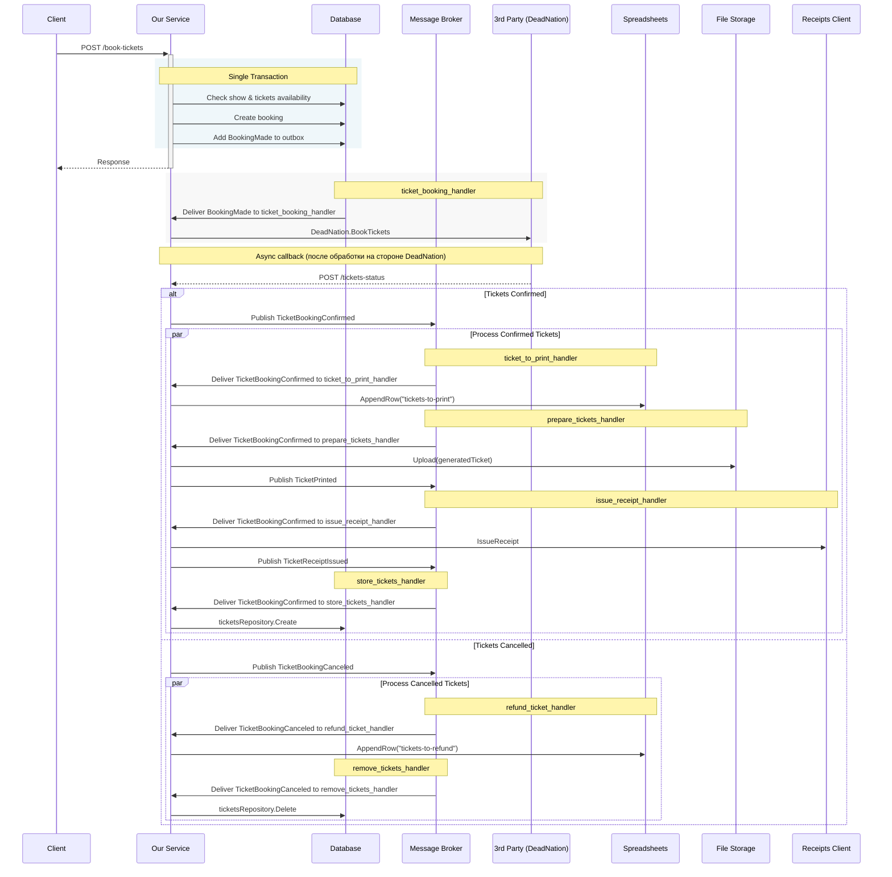
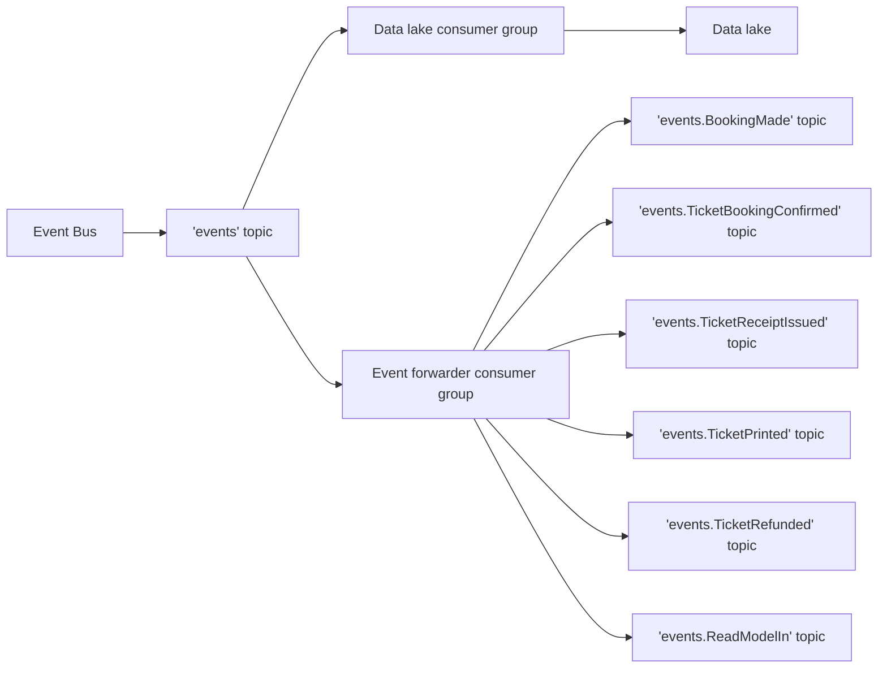
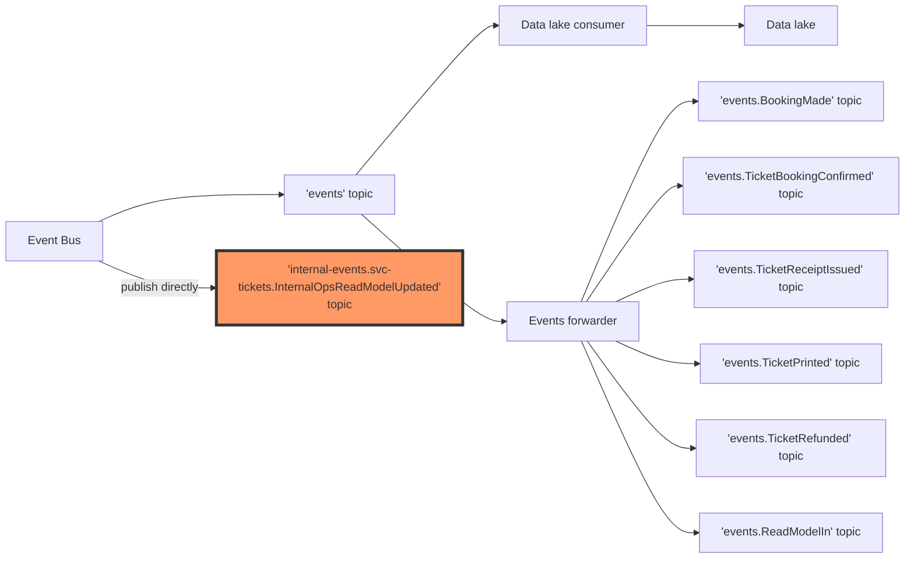
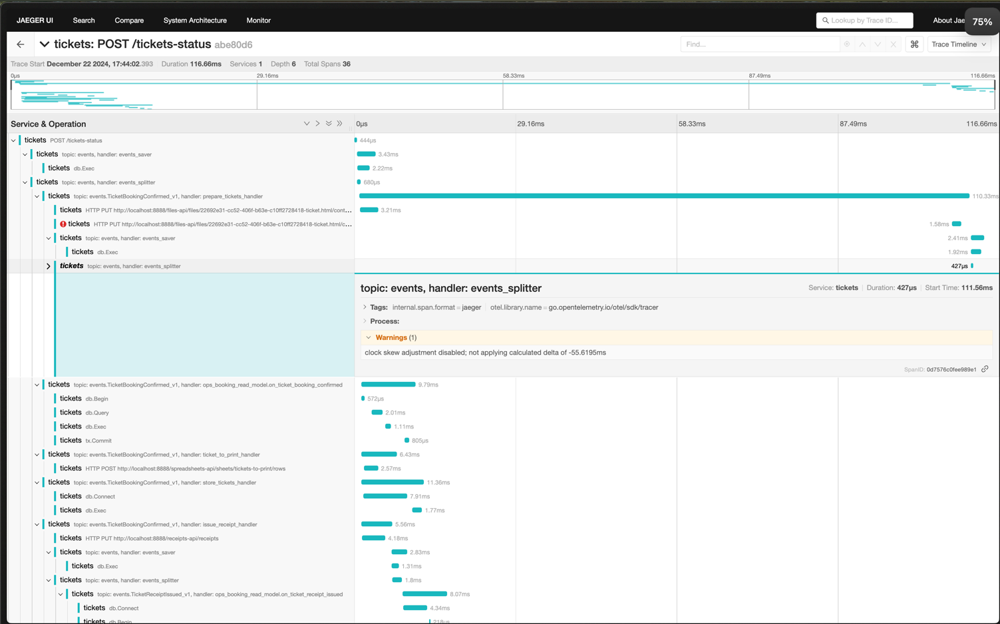

# How to run tests

## Locally

There is a Taskfile in the project root directory. 
You need to run before the test
* gateway container
* redis container
* service container or service locally


Before running the tests, you need to adjust the environment variables in the `test-component-local` task.

```bash
task local-test-deps # run gateway and redis
task app # run service
task test-component-local # run tests
```


## Diagram





### Events 


### Internal Events



## Tracing with OpenTelemetry and Jaeger

