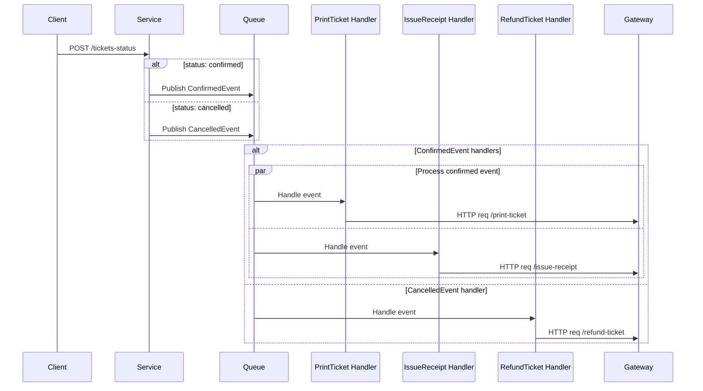

```mermaid
sequenceDiagram
    participant C as Client
    participant S as Service
    participant Q as Queue
    participant H1 as PrintTicket Handler
    participant H2 as IssueReceipt Handler
    participant H3 as RefundTicket Handler
    participant G as Gateway

%% Request handling and event publishing
    C->>S: POST /tickets-status
    alt status: confirmed
        S->>Q: Publish ConfirmedEvent
    else status: cancelled
        S->>Q: Publish CancelledEvent
    end

%% Event processing
    alt ConfirmedEvent handlers
        par Process confirmed event
            Q->>H1: Handle event
            H1->>G: HTTP req /print-ticket
        and
            Q->>H2: Handle event
            H2->>G: HTTP req /issue-receipt
        end
    else CancelledEvent handler
        Q->>H3: Handle event
        H3->>G: HTTP req /refund-ticket
    end
```